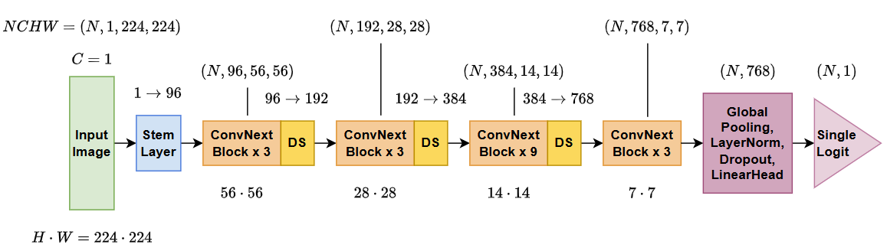
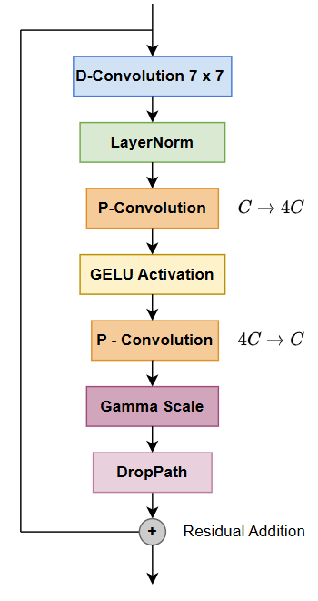

# ConvNext Model for Classifying Alzeimers from Brain MRI scans
**Xander Akison (s4742991)**
### Table of Contents
- [ConvNext Model for Classifying Alzeimers from Brain MRI scans](#convnext-model-for-classifying-alzeimers-from-brain-mri-scans)
    - [Table of Contents](#table-of-contents)
    - [Introduction](#introduction)
    - [Problem Outline](#problem-outline)
    - [Package Overview](#package-overview)
    - [Model](#model)
    - [Data Loading](#data-loading)
    - [Training](#training)
    - [Testing/Prediction](#testingprediction)
    - [Results](#results)
    - [Conclusion](#conclusion)
    - [References](#references)
    - [Dependencies](#dependencies)
### Introduction
Diagnosis through image classification of medical scans is becoming an increasingly more valuable use of pattern recognition tools in the modern world. With more and more accurate models arising constantly, the technology is seeing a greater adoption in clinical environments to help streamline health diagnosis and reduce costs. One of these developments is the adaption of traditional convolutional networks with newer Vision Transformer (ViT) models that allow for better global understanding from an input image. These new ConvNext models provide better regularisation across training data, improving test data accuracy.
### Problem Outline
This package seeks to implement a ConvNext Model capable of identifying Alzheimer's disease from labelled brain MRI scans contained in the Alzheimer's disease Neuroimaging Initiative (ADNI) dataset. The goal accuracy as provided in the ask is 80% or greater.
### Package Overview
This package is divided into four python code base files. 
1. [`modules.py`](modules.py): Contains the base code for the model and its associated blocks. 
   - get_model(): provides access to the ConvNext class
   - count_parameters(): Counts and returns the number of trainable parameters
2. [`dataset.py`](dataset.py): Contains the code base for the ADNIDataset class and provides access to data loaders for use in accessing the ADNI data set.
   - get_data_loaders(): Returns data loaders for the train, validation and test sets
   - compute_mean_std(): Computes the mean and standard deviation for a dataset, useful for data normalization
   - compare_transformed_images(): Saves an image showing a comparison between images pulled directly from the raw data and images after transformations have been applied
3. [`train.py`](train.py): Uses both the dataset and modules files to load data and train the model. Saving the finished model for later access.
   - train(): Trains the model, this is called if the file is run, thus typical usage is to run the [`train.py`](train.py) file directly
4. [`predict.py`](predict.py): Loads in a previous model (saved from training) and runs the model on the test dataset.
   - predict(): Runs prediction, this is called if the file is run, thus typical usage is to run the [`predict.py`](predict.py) file directly
### Model
[`modules.py`](modules.py)

*Figure 1: ConvNext Architecture*
The designed model followed the standard practice structure. Incorporating four ConvNext Layers with the standard [3, 3, 9, 3] layout commonly seen in ConvNext-Tiny and ConvNext-Small applications. Where the balance of efficiency and power is paramount for classification success without spending large amounts of resources training too many weights. The larger third layer provides good mid-level feature extraction, something that is particularly useful in MRI image reasoning as it captures a lot of semantic abstraction, improving generalization.  
**Stem Layer**: The stem layer helps reduce spatial complexity by reducing the image height and width by a factor of four using a 2D convolution with a kernel and stride of four. Simultaneously, this layer takes the input dimension of one (greyscale) and creates enough output channels for the first ConvNext block (in this case 96 channels). The output is then normalized using layer norm before being passed into the series of computational blocks.
**ConvNext Block:** The model includes four ConvNext layers, each with double the channels as the previous block and a quarter of the image dimension space as the previous (from downsampling). The blocks follow the structure shown in Figure 2.

*Figure 2: ConvNext Block*
The major differences to note between ConvNext and traditional ConvNet are:
- Change from standard Conv2d to Depthwise Conv2d: Groups the convolution by channels to reduce computation and capture broader context.
- Change from BatchNorm to LayerNorm: Improves stability for small batch sizes
- Activation uses GELU instead of ReLU
- Residual Scaling: The Gamma Scale step slowly increases the transformations effect on the residual outcome
- DropPath: Random chance of not using transform at all, helps improve regularization  

These changes allow for ConvNext models to generalize better on input by making each block behave more like a ViT without using attention.
### Data Loading
[`datset.py`](dataset.py)
The ADNI data set can be downloaded from the [ADNI](https://adni.loni.usc.edu/) website. Although for the purposes of this report, the data was used directly from the University of Queensland's (UQ) rangpur cluster, where the train and test datasets were pulled from /home/groups/comp3710/ADNI. The provided data set contains 21520 labelled samples taken from 1076 total patients for training, and a further 9000 samples and 450 patients for testing.  
To improve regularization and prevent overfitting to the training data, a series of random transformations are performed on the training set.
1. Random Image Cropping: Randomly crops between 80% and 100% of the image and resizes it to fit the 224 x 224 requirement
2. Random Horizontal Flipping: Simulates left-right anatomical symmetry
3. Random Rotation: Performs a random rotation up to 15 degrees from the starting position
4. Random Translation & Scaling: Up to 10% translation and 10% scaling
5. Gaussian Noise: Adds some noise to the image
6. Random Image Intensity Scale: Scales the image intensity between 0.9 and 1.1
7. Normalize: Normalizes the image using pre calculated mean and standard deviation

The combination of these transforms give the model the best chance to avoid overfitting and generalize. As mentioned in step 7, the model normalizes the images. The mean and standard deviation of the training set is dynamically calculated every time the model is run, thus allowing for different training sets to be used, for computational sake this could be hard coded if the model's training data was known in advance.
### Training
[`train.py`](train.py)
Training is performed on the ADNI dataset by running the [`train.py`](train.py) file or calling its train() function. This will 
### Testing/Prediction
### Results
### Conclusion
### References
https://www.researchgate.net/figure/The-architecture-of-the-ConvNeXt_fig4_361955951
https://github.com/shakes76/PatternAnalysis-2024/blob/main/recognition/47049358/README.md

### Dependencies