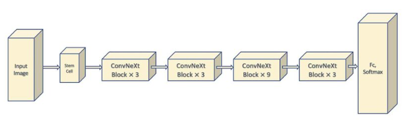

ConvNeXt Model for solving project 8
Classify Alzheimer’s disease (normal and AD) of the ADNI brain data (see Appendix for link) using one
 of the latest vision models such as the ConvNeXt [9] or GFNet [10] set having a minimum accuracy of 0.8
 on the test set. [Hard Difficulty]

Dataset located at:
/home/groups/comp3710/ADNI
on Rangpur cluster

# ConvNext Model for Classifying Alzeimers from Brain MRI scans
**Xander Akison (s4742991)**
### Table of Contents
- [ConvNext Model for Classifying Alzeimers from Brain MRI scans](#convnext-model-for-classifying-alzeimers-from-brain-mri-scans)
    - [Table of Contents](#table-of-contents)
    - [Introduction](#introduction)
    - [Problem Outline](#problem-outline)
    - [Model](#model)
    - [Data Loading](#data-loading)
    - [Training](#training)
    - [Testing/Prediction](#testingprediction)
    - [Results](#results)
    - [Conclusion](#conclusion)
    - [References](#references)
    - [Dependencies](#dependencies)
### Introduction
Diagnosis through image classification of medical scans is becoming an increasingly more valuable use of pattern recognition tools in the modern world. With more and more accurate models arising constantly, the technology is seeing a greater adoption in clinical environments to help streamline health diagnosis and reduce costs. One of these developments is the adaption of traditional convolutional networks with newer Vision Transformer (ViT) models that allow for better global understanding from an input image. These new ConvNext models provide better regularisation across training data, improving test data accuracy.
### Problem Outline
This package seeks to implement a ConvNext Model capable of identifying Alzheimer's disease from labelled brain MRI scans contained in the ADNI dataset. The goal accuracy as provided in the ask is 80% or greater.
### Model
[`modules.py`](modules.py)

*Figure 1: ConvNext Architecture*
The designed model followed the standard practice structure. Incorporating four ConvNext Layers with the standard [3, 3, 9, 3] layout commonly seen in ConvNext-Tiny and ConvNext-Small applications. Where the balance of efficiency and power is paramount for classification success without spending large amounts of resources training too many weights. The larger third layer provides good mid-level feature extraction, something that is particularly useful in MRI image reasoning as it captures a lot of semantic abstraction, improving generalization.  

The models ConvNext blocks also follow standard practises
### Data Loading
### Training
### Testing/Prediction
### Results
### Conclusion
### References
https://www.researchgate.net/figure/The-architecture-of-the-ConvNeXt_fig4_361955951
### Dependencies