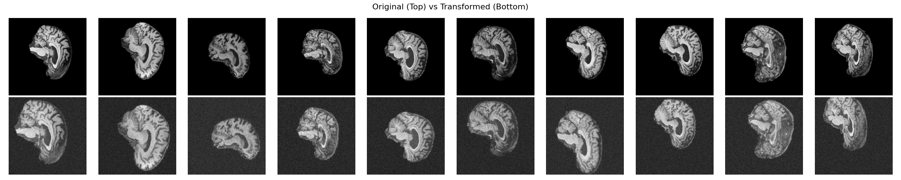

# ConvNext Model for Classifying Alzeimers from Brain MRI scans
**Xander Akison (s4742991)**
### Table of Contents
- [ConvNext Model for Classifying Alzeimers from Brain MRI scans](#convnext-model-for-classifying-alzeimers-from-brain-mri-scans)
    - [Table of Contents](#table-of-contents)
    - [Introduction](#introduction)
    - [Problem Outline](#problem-outline)
    - [Package Overview](#package-overview)
    - [Model](#model)
    - [Data Loading](#data-loading)
    - [Training](#training)
    - [Testing/Prediction](#testingprediction)
    - [Results](#results)
    - [Conclusion](#conclusion)
    - [References](#references)
    - [AI Usage](#ai-usage)
    - [Dependencies](#dependencies)
### Introduction
Diagnosis through image classification of medical scans is becoming an increasingly more valuable use of pattern recognition tools in the modern world. With more and more accurate models arising constantly, the technology is seeing a greater adoption in clinical environments to help streamline health diagnosis and reduce costs. One of these developments is the adaption of traditional convolutional networks (ConvNet) with newer Vision Transformer (ViT) models that allow for better global understanding from an input image. These new next generation convolution models (ConvNext) provide better regularisation across training data, improving test data accuracy.
### Problem Outline
This package seeks to implement a ConvNext Model capable of identifying Alzheimer's disease from labelled brain MRI scans contained in the Alzheimer's disease Neuroimaging Initiative (ADNI) dataset. The goal accuracy as provided in the task is 80% or greater.
### Package Overview
This package is divided into four python code base files. 
1. [`modules.py`](modules.py): Contains the base code for the model and its associated blocks. 
   - get_model(): provides access to the ConvNext class
   - count_parameters(): Counts and returns the number of trainable parameters
2. [`dataset.py`](dataset.py): Contains the code base for the ADNIDataset class and provides access to data loaders for use in accessing the ADNI data set.
   - get_data_loaders(): Returns data loaders for the train, validation and test sets
   - compute_mean_std(): Computes the mean and standard deviation for a dataset, useful for data normalization
   - compare_transformed_images(): Saves an image showing a comparison between images pulled directly from the raw data, and images after transformations have been applied
3. [`train.py`](train.py): Uses both the dataset and modules files to load data and train the model. Saving the finished model for later access under the file best_model.pth.
   - train(): Trains the model, this is called if the file is run, thus typical usage is to run the [`train.py`](train.py) file directly
4. [`predict.py`](predict.py): Loads in a previous model (saved from training) and runs the model on the test dataset.
   - predict(): Runs prediction, this is called if the file is run, thus typical usage is to run the [`predict.py`](predict.py) file directly
### Model
[`modules.py`](modules.py)

*Figure 1: ConvNext Architecture*
The designed model followed the standard practice structure. Incorporating four ConvNext Layers with the standard [3, 3, 9, 3] layout commonly seen in ConvNext-Tiny and ConvNext-Small applications. Where the balance of efficiency and power is paramount for classification success without spending large amounts of resources training too many weights. The larger third layer provides good mid-level feature extraction, something that is particularly useful in MRI image reasoning as it captures a lot of semantic abstraction, improving generalization. Shown in figure 1 is the NCHW tensor size with N = batch size, C = channel number, H = input height (image pixels) and W = input width (also image pixels). The figure also shows the channel depths for each layer, starting at the grey scale single channel input and scaling to [96, 192, 384, 768].  
**Stem Layer**: The stem layer helps reduce spatial complexity by reducing the image height and width by a factor of four using a 2D convolution with a kernel and stride of four. Simultaneously, this layer takes the input dimension of one (greyscale) and creates enough output channels for the first ConvNext block (in this case 96 channels). The output is then normalized using layer norm before being passed into the series of computational blocks.
**ConvNext Block:** The model includes four ConvNext layers, each with double the channels as the previous block and a quarter of the image dimension space as the previous (from downsampling). The blocks follow the structure shown in Figure 2.

*Figure 2: ConvNext Block*
The major differences to note between ConvNext and traditional ConvNet are:
- Change from standard Conv2d to Depthwise Conv2d: Groups the convolution by channels to reduce computation and capture broader context.
- Change from BatchNorm to LayerNorm: Improves stability for small batch sizes
- Activation uses GELU instead of ReLU
- Residual Scaling: The Gamma Scale step slowly increases the transformations effect on the residual outcome
- DropPath: Random chance of not using transform at all, helps improve regularization  

These changes allow for ConvNext models to generalize better on input by making each block behave more like a ViT without using attention.
### Data Loading
[`datset.py`](dataset.py)
The ADNI data set can be downloaded from the [ADNI](https://adni.loni.usc.edu/) website. Although for the purposes of this report, the data was used directly from the University of Queensland's (UQ) rangpur cluster, where the train and test datasets were pulled from /home/groups/comp3710/ADNI. The provided data set contains 21520 labelled samples taken from 1076 total patients for training, and a further 9000 samples and 450 patients for testing.  
To improve regularization and prevent overfitting to the training data, a series of random transformations are performed on the training set.
1. Random Image Cropping: Randomly crops between 80% and 100% of the image and resizes it to fit the 224 x 224 requirement
2. Random Rotation: Performs a random rotation up to 15 degrees from the starting position
3. Random Translation & Scaling: Up to 10% translation and 10% scaling
4. Gaussian Noise: Adds some noise to the image
5. Random Image Intensity Scale: Scales the image intensity between 0.9 and 1.1
7. Normalize: Normalizes the image using pre calculated mean and standard deviation
A few image samples and the associated transformations are shown below.

The combination of these transforms give the model the best chance to avoid overfitting and help it to generalize. As mentioned in step 7, the model normalizes the images. The mean and standard deviation of the training set is dynamically calculated every time the model is run, thus allowing for different training sets to be used, for computational sake this could be hard coded if the model's training data was known in advance.
### Training
[`train.py`](train.py)
Training is performed on the ADNI dataset by running the [`train.py`](train.py) file or calling its train() function. This will load in the train and validation data loaders as well as create an instance of the model from [`modules.py`](modules.py). Then the model will be trained with the following training configuration in place.
| Component | Value |
| --------- | ---- |
| Loss Function | BCEWithLogitsLoss|
| Optimizer | AdamW |
| Scheduler | CosineAnnealingLR | 
| Total Epochs | 50 |
| Batch Size | 32 | 
| Learning Rate | 0.001 |
| Weight Decay | 0.0001 |
| Patience | 10 |

The BCEWithLogitsLoss function is used for binary classification and uses function
$$Loss = - [y \cdot log(\sigma(x)) + (1 - y)\cdot log(1 - \sigma(x))]$$
Where $\sigma(x)$ is the sigmoid of the raw model output and $y$ is the true label. This combines both sigmoid activation and binary cross-entropy loss into one function, making it more numerically stable.  
The AdamW optimizer decouples weight decay from gradient updates, helping to improve generalization, something that is crucial for medical classification.  
The CosineAnnealingLR scheduler slowly lowers the learning rate over time, this helps to encourage smoother convergence.  
The remaining hyper parameters were experimented with and found through trial and error. The patience hyper parameter is not required for the model to operate correctly, although was implemented to help free computational resources. It cuts training early, if after a number of epochs, the validation accuracy isn't improving.    

Note that the accuracy scores and measurements are performed using patient level aggregation, meaning that the model predicts alzheimer's on a per patient basis, not on a per scan basis. This can be modelled with the following function.
$$\hat{y}_p = \begin{cases}1 \text{ if } \frac{1}{|S_p|}\Sigma_{x_i\in S_p}f(x_i)>0.5\\0\end{cases}$$
Where P is the set of all patients, $S_p = \{x_1, x_2, \dots, x_n\}$ for some $p \in P$, $f(x_i)$ is the model's sigmoid output for a scan $x_i$ and $\hat{y_p}$ is the predicted label for a patient. Finally, the accuracy can be computed with;
$$\text{Accuracy} = \frac{1}{|P|}\Sigma_{p\in P}1[\hat{y_p} = y_p]$$
Where 1[] is the indicator function, returning 1 if the input is true and 0 otherwise.
### Testing/Prediction
[`predict.py`](predict.py)
Testing of the model can be performed by running the [`predict.py`](predict.py) file or calling its predict() function directly. This will load in the saved model and test its accuracy on the test dataset, just like with training, the same patient level loss aggregation is used to find the accuracy. Unlike with the training set, all samples pulled from the data loader have not undergone the same random transformations as the training set. This provides the model with clean samples to perform prediction on, the only transform used is the resize, which maintains consistency between all samples at 224 x 224 pixels.
### Results
The final model was not able to reach the 80% required target, with the highest test result being 78.44%. The major difficulties experienced were finding a balance between a simple model capable of accurately capturing the MRI features needed and not creating a model that over fit to the training data. In the models current state there are $\approx 27$ million trainable parameters, it was found that simplifying the model would cause it to struggle to capture the needed features. Consequently most of the focus was put on trying to force the model to regularize better since its training and validation accuracy frequently reached over 97% during training.  
With more time to run further models and experiment with the hyper parameters, it may have been possible to achieve the desired 80% accuracy. Ideas to improve the model include.
- Increasing the amount of randomness the training set experienced before being trained on.
- Adjusting the model architecture to include more blocks in the final stage, instead of [3, 3, 9, 3], a [3, 3, 9, 6] model might be able to capture additional features without overfitting
- Inclusion of ensemble methods, these are reported to reach accuracies as high as 95% [biorxiv](https://www.biorxiv.org/content/10.1101/2025.07.10.664260v1.full)
### Conclusion
In conclusion, although the model was unable to achieve an accuracy of 80%, the model is showing a lot of promise especially due to it's relatively low training time. If there was more time to experiment on the current architecture to improve generalization, there is no doubt a ConvNext classifier would be capable of achieving the task.
### References
Research gate, The layout of the architecture diagram was inspired from this source
https://www.researchgate.net/figure/The-architecture-of-the-ConvNeXt_fig4_361955951
Previous year example paper referenced for report structure
https://github.com/shakes76/PatternAnalysis-2024/blob/main/recognition/47049358/README.md
Preliminary research on ConvNext models for ADNI data provided default hyper parameter inspiration
https://www.biorxiv.org/content/10.1101/2025.07.10.664260v1.full
### AI Usage
This package made use of AI code generation using the free version of Microsoft Copilot. Although mostly complete, additional ideation and debugging had to be performed on the generated code base. No AI was used in writing this report.
### Dependencies
The dependencies are listed below, they are also listed in the correct format in requirements.txt
- torch=2.7.1+cu118
- torchvision=0.22.1+cu118
- torchaudio=2.7.1+cu118
- numpy=2.1.2
- scikit-learn=1.7.2
- scikit-image=0.25.2
- matplotlib=3.10.5
- pillow=11.0.0
- tqdm=4.67.1
- imageio==2.37.0
- umap-learn=0.5.9.post2
- joblib=1.5.2
- networkx=3.3
- numba=0.61.2
- sympy=1.13.3
- typing-extensions=4.12.2
